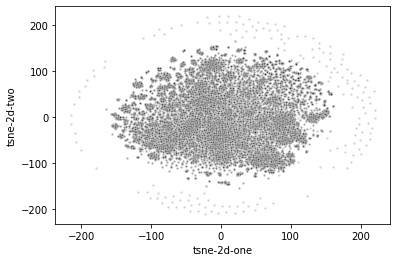
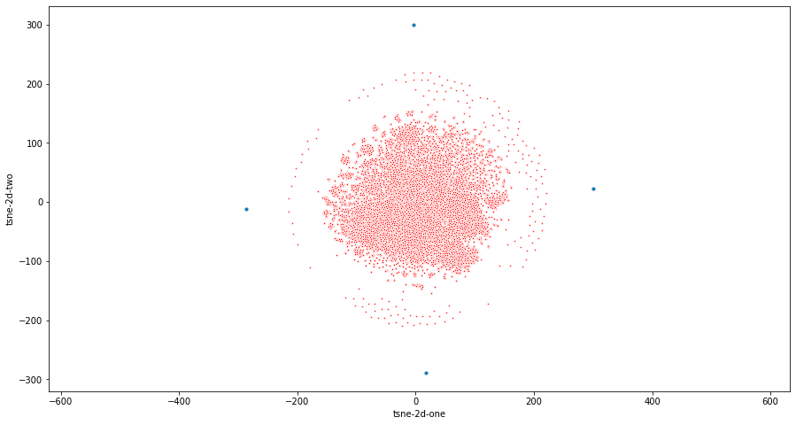
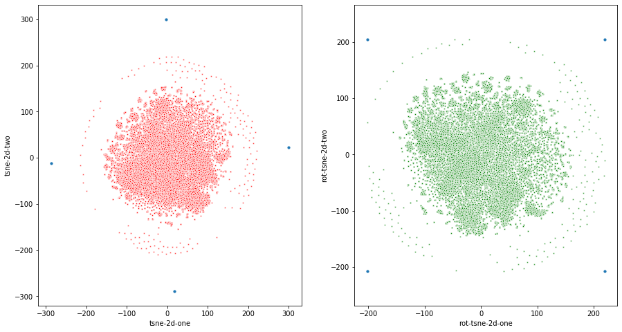
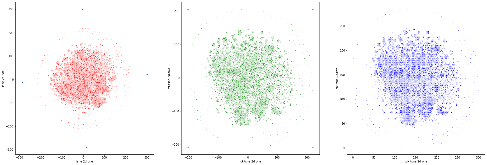
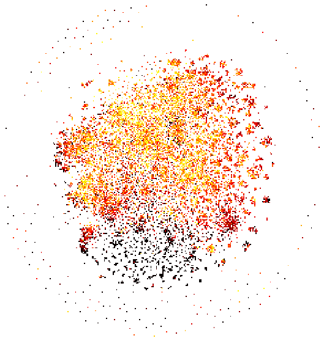

# deepinsight_py
## Python implementation of the DeepInsight algorithm (original: MATLAB) 
### Original Paper: https://www.nature.com/articles/s41598-019-47765-6 Alok Sharma, Edwin Vans, Daichi Shigemizu, Keith A Boroevich, and Tatsuhiko Tsunoda. Deepinsight: A methodology to transform a non-image data to an image for convolution neural network architecture. Scientific reports, 9(1):1–7, 2019
#### INPUT: TSNE LOCATIONS
#### OUTPUT: IMAGE GENERATED BY THE ALGORITHM

#### Algorithm works as follows:
> **1: The user has to perform tsne/kpca/umap (any dimensionality reduction algorithm) and generate the locations.**
>  **I got the following plot when I performed tsne on some gene expression data**

> **2: Find the vertices of the Minimum Bounding Rectangle**

> **3: Rotate the image**

> **4: Convert from cartesian domain to pixel domain**
> **Step 1-2-3 shown together**

> **5: Map the respective intensities to the coordinates**

> **Image is ready to be used in any CNN architecture**
